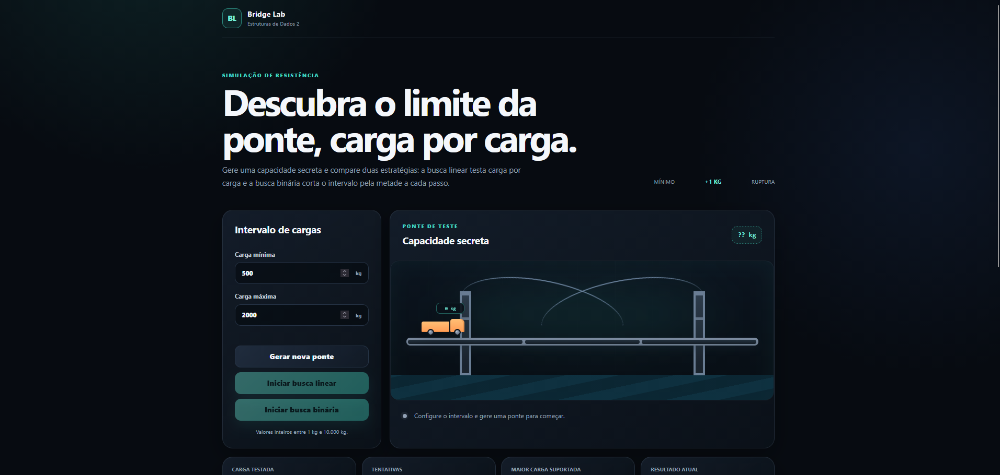

# G11_busca_EDA2-2026.2

**Conteúdo da Disciplina**: Algoritmos de Busca

## Sobre
O **Bridge Lab** é uma aplicação interativa que implementa e compara dois algoritmos de busca: busca linear e busca binária. 

O projeto utiliza o cenário de uma ponte com capacidade máxima desconhecida, onde os usuários podem gerar uma capacidade secreta e testar duas estratégias diferentes para descobri-la:

- Busca Linear: Testa carga por carga sequencialmente
- Busca Binária: Corta o intervalo pela metade a cada passo


## Screenshot



## Site
Acesse ele [aqui](https://eda2-2026.github.io/G11_busca_EDA2-2026.2/).

## Vídeo
Assista o vídeo de apresentação [aqui](https://youtu.be/2QgWwxlbNuU).

## Funcionalidades
- Geração de capacidade máxima aleatória
- Comparação lado a lado entre busca linear e binária
- Métricas de desempenho (número de tentativas, eficiência)
- Interface responsiva e acessível

## Instalação
**Linguagem**: `JavaScript`<br>
**Framework**: `Nenhum (HTML5 puro)`<br>
**Dependências**: Nenhuma

### Requisitos:
- Navegador web moderno com suporte a HTML5

### Como executar:
1. Abra o arquivo `src/index.html` diretamente em um navegador
2. Ou sirva através de um servidor web local:
   ```bash
   python -m http.server 8000
   ```
   Depois acesse `http://localhost:8000/src/`

## Uso
1. Gere uma capacidade secreta para a ponte usando o botão disponível na interface.
2. Execute a simulação da busca linear para verificar carga por carga.
3. Execute a simulação da busca binária para observar a redução do intervalo a cada tentativa.
4. Compare os resultados visualmente, incluindo o número de tentativas e a eficiência de cada algoritmo.

## Estrutura
```text
.
├── README.md
├── index.html              # Estrutura principal da interface
├── package.json            # Configuração do projeto e scripts de teste
├── css/
│   └── style.css          # Estilos da aplicação
├── js/
│   ├── app.js             # Lógica da interface e animações
│   ├── binary-search.js   # Implementação da busca binária
│   └── linear-search.js   # Implementação da busca linear
├── tests/
│   ├── interface.test.js  # Testes da interface
│   ├── linear-search.test.js
│   └── helpers/
│       └── fake-dom.js    # Utilitários para testes de DOM
├── assets/
│   └── print.png          # Screenshot do projeto
└── .gitignore
```
